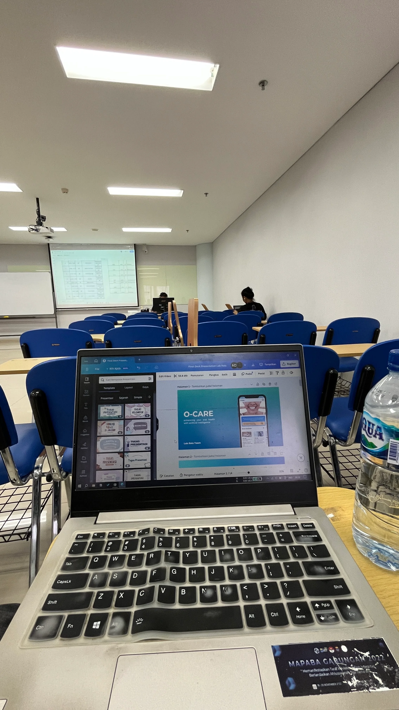
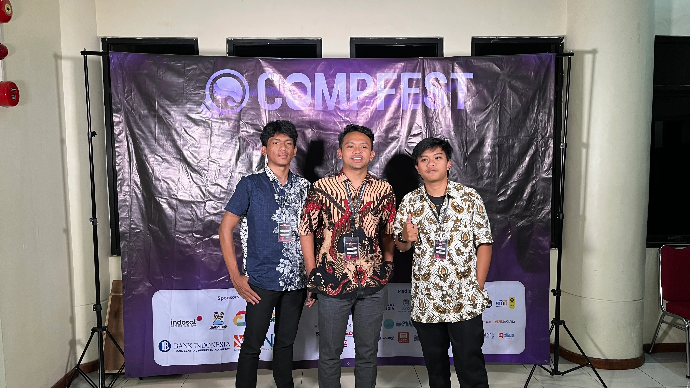
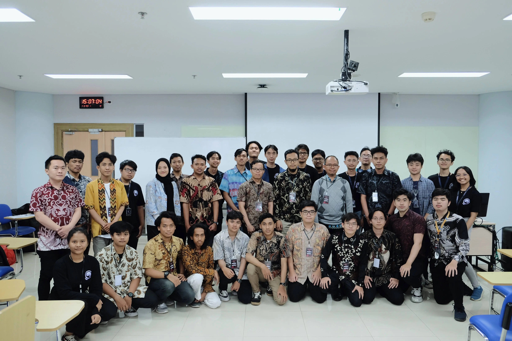
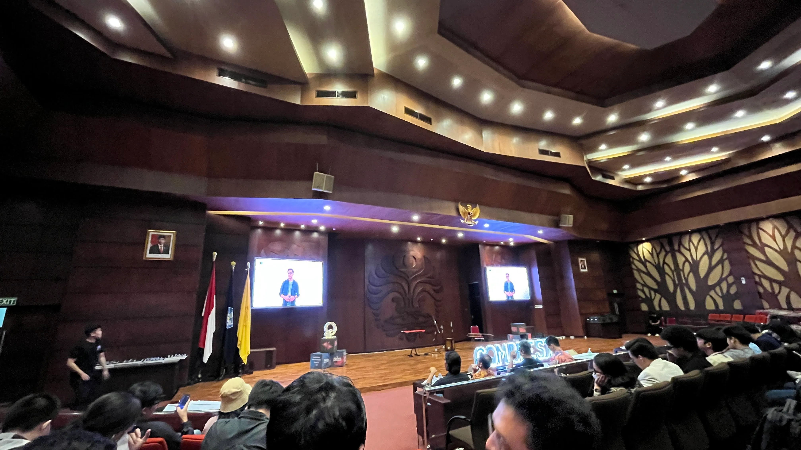

## Expressing Gratitude

It is with great joy and honor that I announce I have reached the final round of the national **[Compfest Competition](https://compfest.id)**, organized by the Faculty of Computer Science, University of Indonesia. I am truly grateful for this incredible opportunity to represent my campus on the international stage. I would also like to extend my deepest appreciation to my instructors and program coordinators who have been a continuous source of inspiration and played an essential role in this achievement.

## About Competition

This competition is part of Compfest, focused on the _Artificial Intelligence (AI)_ competition. Of the 144 teams that registered, only 12 teams made it to the final round. With careful preparation, we traveled from Malang to Jakarta to participate in this competition, where we had the invaluable opportunity to be mentored by professionals in the field.

> We developed an AI-based application for oral health that can detect diseases at an early stage. The technologies we used include _TensorFlow, Kotlin_, and various machine learning libraries with an open-source dataset. Although we did not win, we are proud of the effort we put into this competition and remain excited to continue growing and learning more.

## Captured Moments

### Competition Begun

### Photoboth

### Together

### Awarding Night




